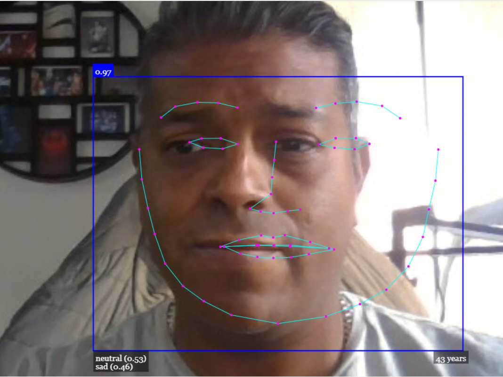

<p align="center"></p>
<h1 align="center"> Face Detection Browser </h1> 
<h4 align="right">Jun 23</h4>

<br>

# API for Face Recognition in the Browser Realtime Face Tracking


Detects age and facial expression.

> :warning: **Warning:** I you need create a server first fot test it!


<p align="center"></p>


## Other API
JavaScript API for Face Recognition in the Browser with tensorflow
https://justadudewhohacks.github.io/face-api.js/docs/index.html

<br>

---
Copyright &copy; 2022 [carjavi](https://github.com/carjavi). <br>
```www.instintodigital.net``` <br>
carjavi@hotmail.com <br>
<p align="center">
    <a href="https://instintodigital.net/" target="_blank"></a>
</p>


# face-detection-browser
API for Face Recognition in the Browser Realtime Face Tracking
